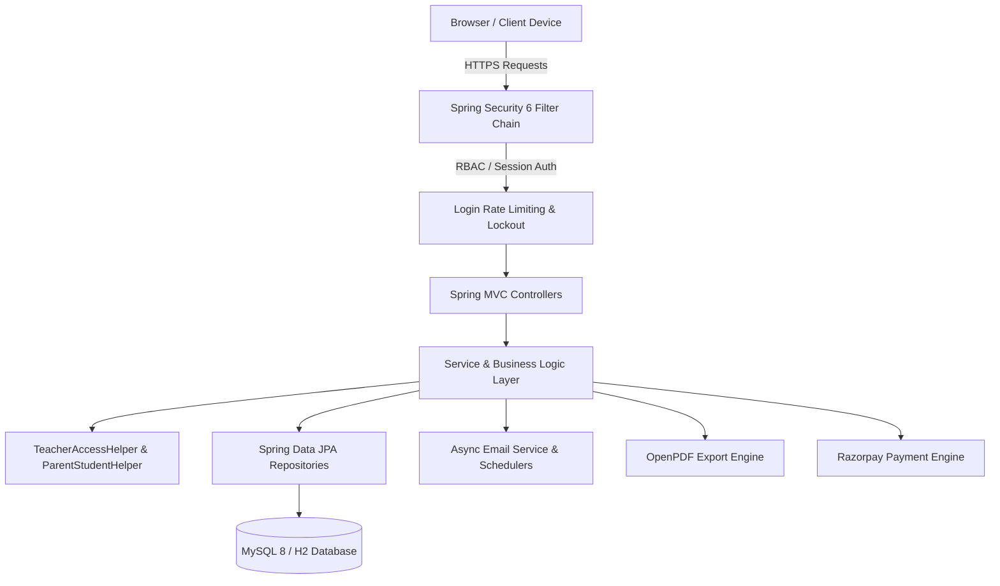
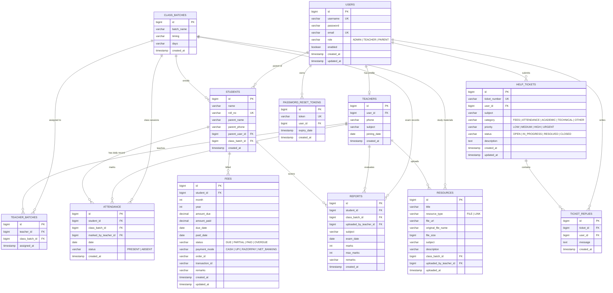
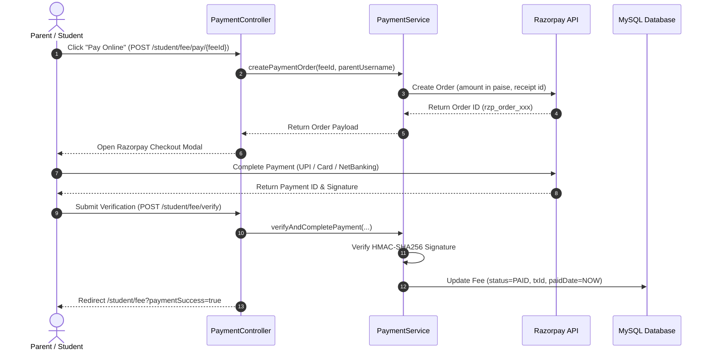

# Shiksha ERP — System Architecture & Technical Specification

## 1. High-Level Architecture Overview

**Shiksha ERP** is an enterprise-grade Coaching Institute Management System designed with Spring Boot 3.3, Spring Security 6, Spring Data JPA, and Thymeleaf + Modern Bento Glassmorphic CSS.

The application follows a clean 3-tier Layered Architecture:

---

## 2. Comprehensive Entity Relationship (ER) Diagram

---

## 3. Security & Access Control Architecture

### 3.1 Role-Based Access Control (RBAC)
- **ROLE_ADMIN**: Complete management rights for students, teachers, batches, batch allocations, monthly fee generation, ticket resolutions, and institute metrics.
- **ROLE_TEACHER**: Isolated to assigned batches only via `TeacherAccessHelper`. Can mark attendance, upload test scores, and distribute study materials. Cannot view or modify data for batches they do not teach.
- **ROLE_PARENT**: Isolated to linked child's data only via `ParentStudentHelper`. Can view attendance records, academic report cards, batch resources, make online fee payments, download official PDF receipts, and file support tickets.

### 3.2 Login Rate Limiting & Account Protection
- In-memory sliding window tracker (`LoginAttemptService`) limits failed login attempts to 5 per 15 minutes.
- Temporary lockouts automatically trigger redirect to `/login?locked=true`.
- Password reset flow uses time-limited, single-use UUID tokens (`PasswordResetToken`).

---

## 4. Asynchronous Events & Notifications

- Powered by `@EnableAsync` and Spring Boot's task executor.
- HTML email templates rendered via Thymeleaf `TemplateEngine`.
- Events:
  1. **Monthly Fee Generated**: Sent to parent with due date & invoice details.
  2. **Overdue Fee Alert**: Triggered by automated daily cron scheduler at 01:00 AM.
  3. **New Support Ticket**: Alerts administration team.
  4. **Support Ticket Resolved**: Notifies ticket author with administrator's remarks.
  5. **Password Reset Token**: Delivers secure, expiring link.

---

## 5. Razorpay Online Payment Flow

